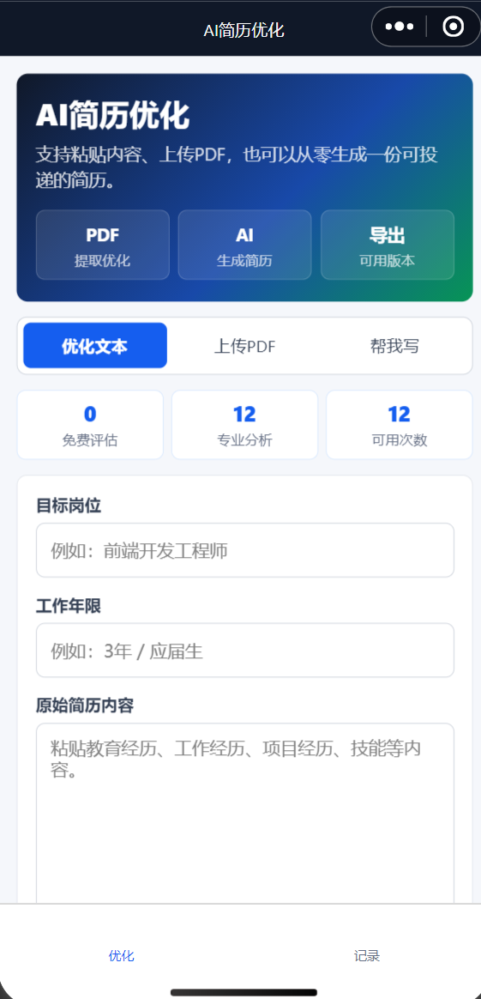
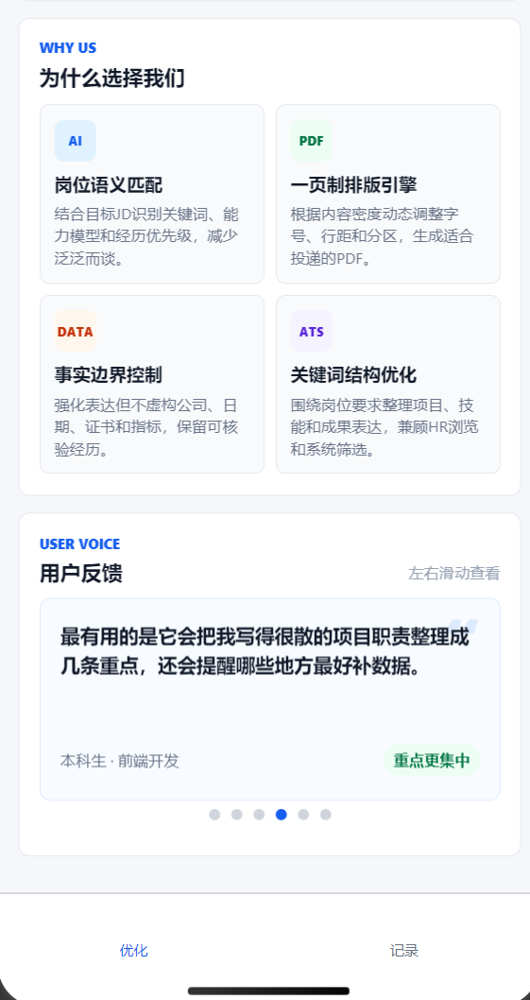
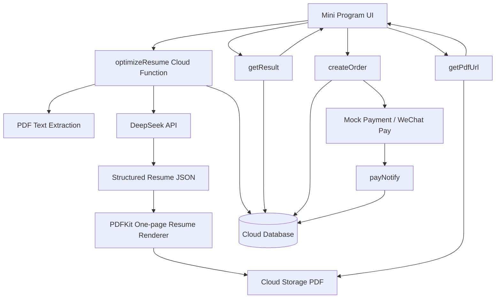

# AI Resume Optimizer Mini Program

一个基于微信小程序、云开发、DeepSeek API 和 PDFKit 的 AI 简历优化项目。项目覆盖从简历输入、PDF 解析、AI 结构化生成、一页制 PDF 排版，到免费额度、模拟支付解锁和云端权限校验的完整链路。

> This is a complete AI mini program engineering demo, not just a static UI prototype.

## Preview

| 首页与简历输入 | 技术能力与用户反馈 |
| --- | --- |
|  |  |

## Features

- 粘贴文本优化简历
- 上传 PDF 简历并提取文字
- 从零填写信息生成简历
- AI 生成岗位匹配评分、优化摘要、亮点、短板和面试建议
- DeepSeek API 结构化 JSON 输出
- PDFKit 生成一页制可投递简历
- 云数据库保存完整结果，前端仅按权限读取
- 免费评估次数和专业分析额度展示
- 模拟支付解锁完整简历与 PDF 下载
- 隐私与 AI 生成内容提示页

## Tech Stack

- WeChat Mini Program
- WeChat Cloud Base / 云开发
- Cloud Functions
- Cloud Database
- Cloud Storage
- DeepSeek Chat API
- `pdf-parse`
- `pdfkit`

## Architecture



More details: [docs/architecture.md](docs/architecture.md)

## Project Structure

```text
.
├── app.js
├── app.json
├── pages
│   ├── index
│   ├── result
│   ├── history
│   └── privacy
├── cloudfunctions
│   ├── optimizeResume
│   ├── getResult
│   ├── getQuota
│   ├── getPdfUrl
│   ├── createOrder
│   ├── payNotify
│   └── deleteResult
├── docs
│   └── screenshots
└── project.config.json
```

## Quick Start

1. 用微信开发者工具导入本项目。
2. 开通微信云开发并创建云环境。
3. 替换 `app.js` 中的云环境 ID：

```js
env: "your-cloud-env-id"
```

4. 创建云数据库集合：

```text
users
resume_results
orders
entitlements
```

5. 上传并部署云函数，建议选择“云端安装依赖”：

```text
optimizeResume
getResult
getQuota
getPdfUrl
createOrder
payNotify
deleteResult
```

6. 配置云函数环境变量。

真实 AI 输出：

```text
DEEPSEEK_API_KEY=your_deepseek_api_key
DEEPSEEK_MODEL=deepseek-v4-pro
```

开发者工具模拟支付：

```text
ENABLE_MOCK_PAY=true
```

演示模式：

```text
ENABLE_DEMO_MODE=true
```

## Payment Flow

项目内置了模拟支付链路，适合开源演示和本地测试：

1. 用户首次获得 1 次免费基础评估。
2. 免费态只展示评分、摘要、欠缺项、部分亮点和简历预览。
3. 点击 3.99 元解锁时调用 `createOrder`。
4. 若 `ENABLE_MOCK_PAY=true`，云函数直接模拟支付成功。
5. 解锁后可查看完整简历、复制正文、下载 PDF，并获得 3 次专业分析额度。

正式微信支付需要企业或个体工商户主体、微信认证、商户号和支付回调配置。本项目默认以开源演示为目标，不包含真实商户配置。

## PDF Generation

PDF 生成由 `pdfkit` 完成，模板目标是输出一页制正式简历：

- 姓名和联系方式置顶
- 教育、经历、技能分区
- 公司/学校与地点左右对齐
- 岗位/学历与日期左右对齐
- 根据内容密度动态调整字号和间距
- 技能区自动拆分标签行
- PDF 正文不展示 AI 痕迹、短板或系统评价语

中文 PDF 需要字体文件。项目内置 `SourceHanSansSC-Regular.otf`，如用于商业用途，请自行确认字体授权。

## Privacy and AI Notice

本项目包含隐私与 AI 说明页，并在首页和结果页提示用户：

- 简历内容会用于 AI 分析与生成
- AI 生成内容仅供求职材料优化参考
- 用户应自行核对所有事实、时间、公司、证书和数据
- 不承诺面试、录用或求职结果
- 可删除云端生成结果和 PDF 文件

## Open Source Notes

开源前请确认：

- 不要提交真实 API Key
- 不要提交真实用户简历或 PDF
- 将 `app.js` 中的云环境 ID 改为占位值
- 将 `project.config.json` 中的真实 AppID 改为 `touristappid` 或自行说明
- 如果使用自己的字体、截图或测试数据，请确认授权

## Disclaimer

This project is for learning, portfolio demonstration, and engineering reference only. AI-generated resume content should be reviewed by users before use. The project does not guarantee interviews, offers, or employment outcomes.

