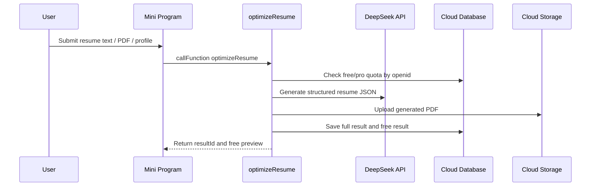
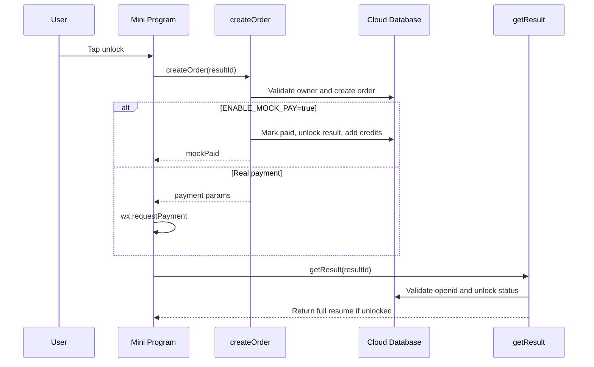

# Architecture

This project is organized around a small set of cloud functions that separate AI generation, result authorization, quota control, mock payment, and PDF access.

## System Flow



## Unlock Flow



## Cloud Functions

- `optimizeResume`: validates quota, calls AI, generates PDF, saves result.
- `getResult`: returns free or unlocked result according to openid.
- `getQuota`: returns free and professional analysis quota.
- `getPdfUrl`: validates ownership and unlock status before returning a temporary PDF URL.
- `createOrder`: creates an unlock order and supports mock payment.
- `payNotify`: handles real payment notification and unlocks entitlement.
- `deleteResult`: deletes cloud result and generated PDF after ownership validation.

## Data Collections

```text
users
resume_results
orders
entitlements
```

The front end should never rely on local state for authorization. Full resume text and PDF access are always checked by cloud functions with the current user's `openid`.

